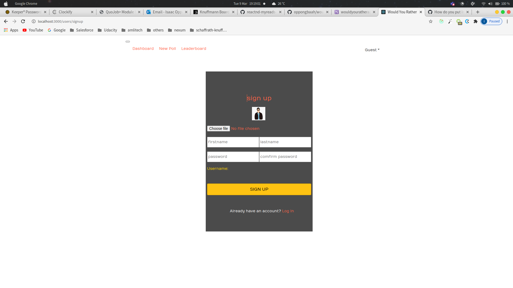
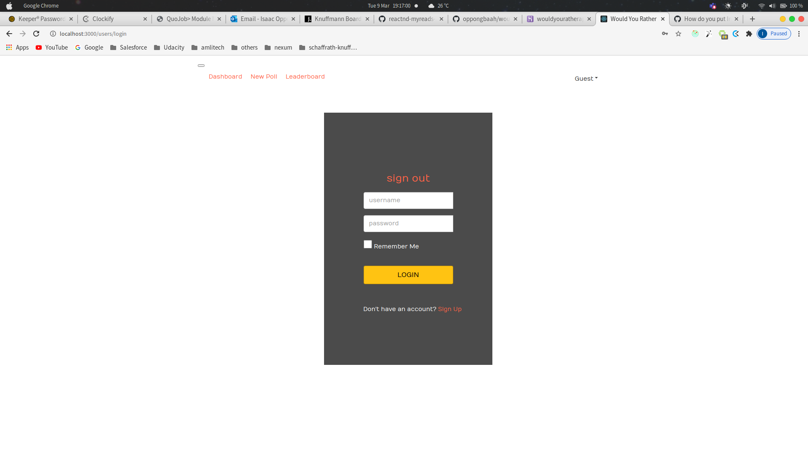
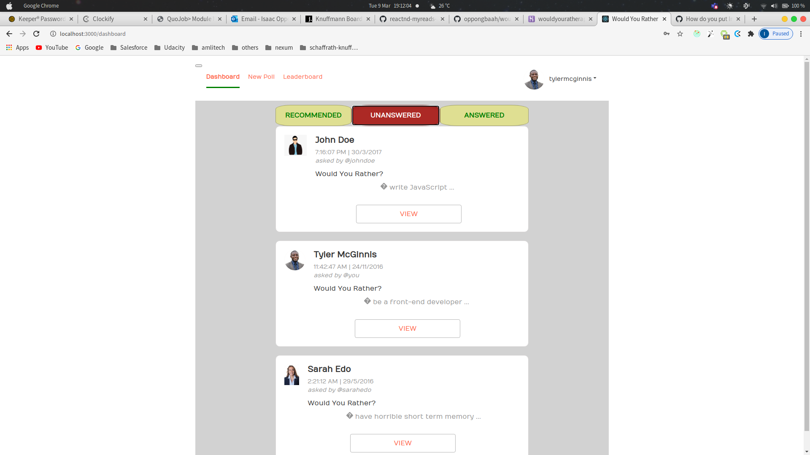
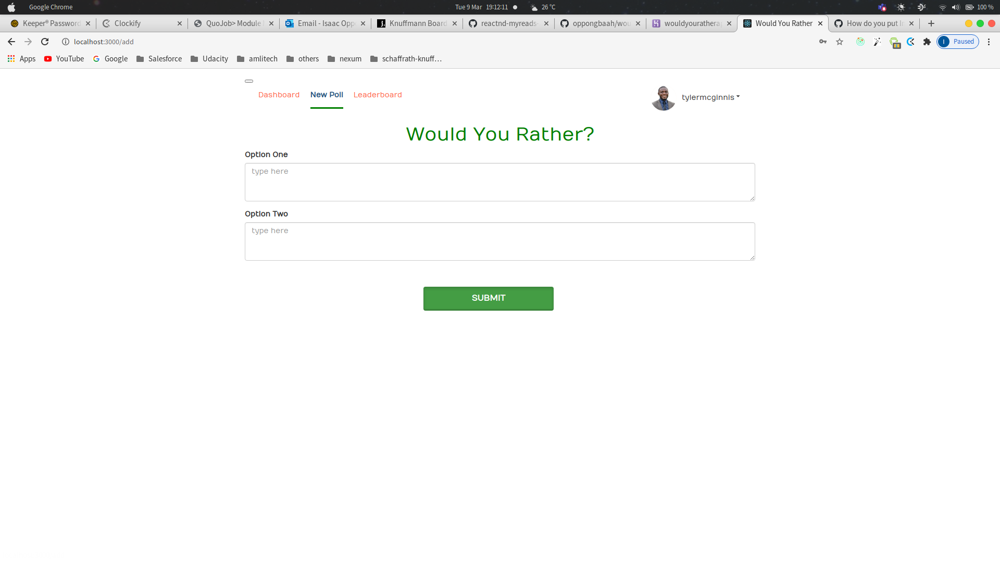
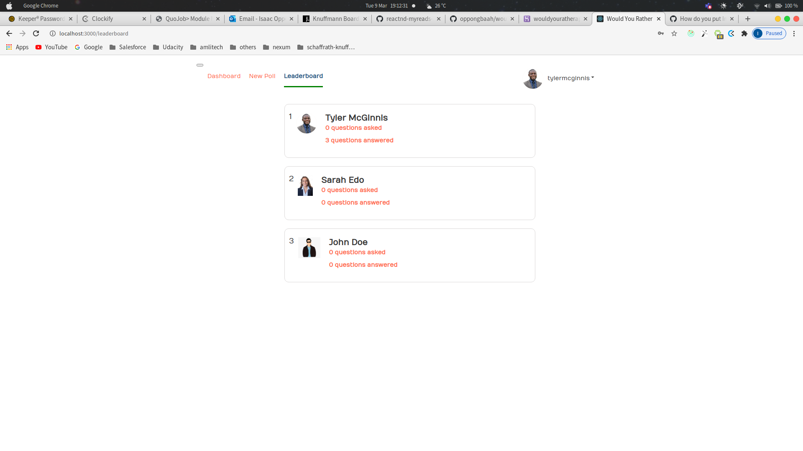
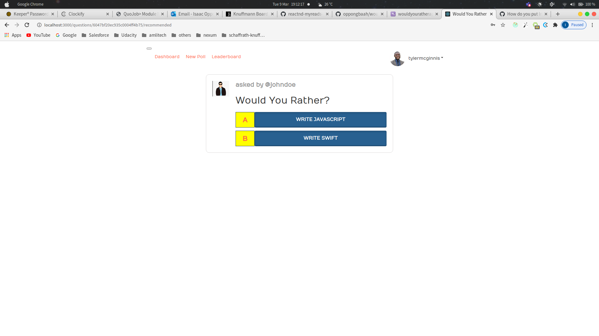
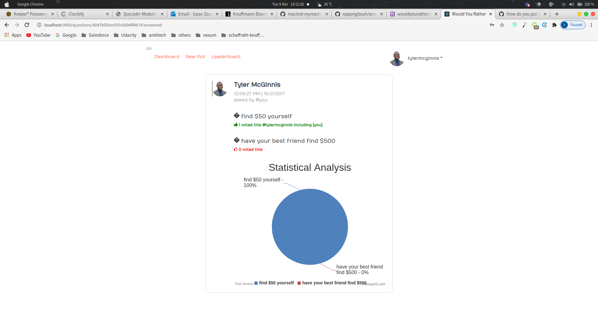

## wouldyourather-frontend
- React front end for the Would You Rather Application

## Installation
- Clone the app from the github repository using
```
https://github.com/oppongbaah/wouldyourather-frontend.git
```

- Navigate to the root directory of the app and install dependencies using
```
npm install
```
- Launch the development server using
```
npm start
```
- If server doesn't start automatically in the browser, click [here](http://localhost:3000) to access the site.

## Introduction
- User can sign up

- Sign in and logout

- A user has the ability to navigate between three catalogs. The dashboard, New Poll and the Leaderboard as shown below. The dashboard has has three diffrent categories. The first category contains a recommended question that is randomly selected from the unanswered questions based on the user logged in. 
- Dashboard

- New Poll

- Leaderboard

- A user is automatically navigated to the question details page upon viewing a question either from the recommended dashboard or from the unanswered questions dashboard. The questions detail page is shown below.

- On the question detail page, the user has the ability to cast a vote between two different options. Voting is done automatically after an option is selected. The user will then be taken to the results page as shown below.


- **NB: Also upon clicking on an poll under the answered dashboard, the user is navigated to the results page as compared to the ones described above under the other dashboard categories.**

## Caution on Limited Functionalities
- Any image uploaded must be added to the paths ```/wouldyourather/public/usersAvatar``` for it to work properly.
- Images name must not contain spaces.
- Username is generated based on the firstname upon signing up. It is clearly visible when entering the firstname on the signup page.
- Password can take any format.
- Permission to use cookies is granted automatically upon logging in to the application.

### ADDITIONAL INFORMATION
1. The application has a backend written in nodejs hosted at a remote server. The full stacked project can be accessed at [wouldyouratherapp](https://wouldyouratherapplication.herokuapp.com)
2. The repository for the backend can be accessed at [wouldyourather-backend](https://github.com/oppongbaah/wouldyourather-backend.git)
2. User must login to access any page. Users login infomation can be accessed at [get_users](https://wouldyouratherapplication.herokuapp.com/users/fetch-all)
3. Cookies are used for better user experience. Login session may last for an hour to expire.

### Lincensing
- Both the front end and back end repositories are open source. Therefore, any interested developer can use it anyway that suits him/her.

- Contact me on oppongbaahisaacmega@gmail.com


